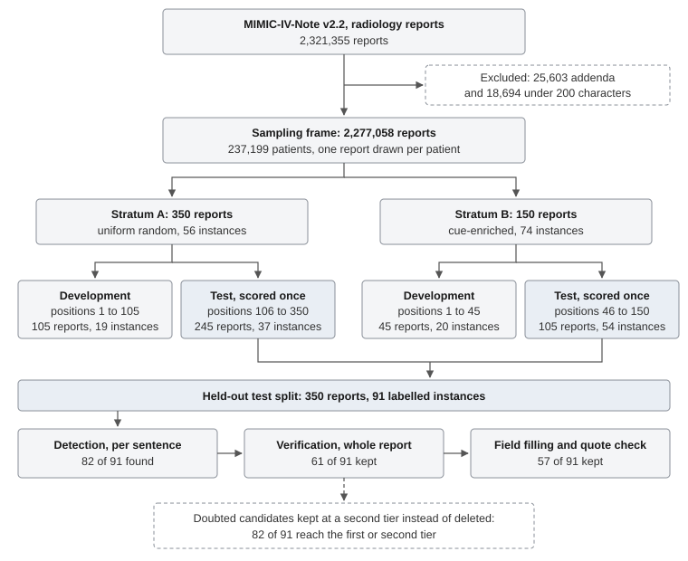

# Finding follow-up recommendations in radiology reports with a small local model: a held-out evaluation and its consequences for a patient-held registry

**Preprint draft, version 0.1**

- **Author:** Dedrani Mohamedsarfaraz Mohamadfiroz, Independent Researcher
- **ORCID:** [0009-0004-7645-7151](https://orcid.org/0009-0004-7645-7151)
- **Contact:** s.dedrani786@gmail.com
- **Date:** 2026-10-06
- **Licence:** CC BY 4.0
- **Related:** concept note [10.5281/zenodo.21706768](https://doi.org/10.5281/zenodo.21706768);
  software [10.5281/zenodo.21708214](https://doi.org/10.5281/zenodo.21708214)
- **Status:** Measurement of an extraction component and a retrospective run of a registry on
  de-identified records. Not a clinical study. No patient saw any output.

---

## Abstract

**Background.** A follow-up recommendation in a radiology report is a duty owed to a patient, and a
large share of them are never acted on. Amanah is an open-source registry that holds each such
recommendation as a portable, patient-held obligation, closed only on evidence. Everything it does
depends on an extractor that finds the recommendations in a report without inventing any.

**Methods.** I drew 500 radiology reports from MIMIC-IV-Note v2.2, one per patient: 350 drawn at random and
150 drawn from reports matching a broad list of cue words. I labelled all 500 by hand under a written
protocol. A blind relabel of 100 of them nineteen days later gave an intra-rater kappa of 0.870. The
extractor runs a 7-billion-parameter model on a laptop CPU in three stages: detection one sentence at
a time, a verification pass with the whole report in view, and field filling. Every quoted string is
checked against the source and refused if it cannot be found there. It was developed on 150 reports,
frozen with its prompt hashes recorded, and scored once on the other 350, against an acceptance rule
fixed in advance: no false positive on any clean report. Separately, the registry's obligation layer
was run over the hand labels, using each report's de-identified date and the patient's later
radiology to exercise closure and escalation.

**Results.** On the random held-out stratum the extractor found 23 of 37 labelled recommendations
(62.2%, 95% CI 46.1 to 75.9), with precision 74.2% and a false positive on 6 of 214 clean reports
(2.8%, 1.3 to 6.0). On the enriched stratum it found 34 of 54 (63.0%). All 80 quoted spans were
located exactly in their source. The extractor failed its acceptance rule. Most lost recall was
removed by the verification pass; when doubted candidates were kept at a second tier instead of
deleted, the share reaching a reviewer rose to 86.5% and 92.6%. The finding's location was right
about a quarter of the time, and neither a 14B model nor a corrected prompt moved it. In the
retrospective run, 6 of 130 recommendations closed automatically, 44 needed a person to confirm a
closure, and 32 were conditional. Two rules in the specification failed on real records and were
changed.

**Conclusions.** A small model running locally can find most follow-up recommendations without
fabricating text. It cannot yet do so without false positives, and it cannot reliably say where the
finding is. Four parts of the specification changed because of these measurements, and the system
turned out to depend on people far more than its design had assumed.

**Keywords:** radiology reports; follow-up recommendations; information extraction; large language
models; loss to follow-up; patient safety; MIMIC-IV

---

## 1. Introduction

Radiologists write follow-up recommendations constantly. Repeat this CT in six months. Ultrasound
this thyroid nodule. Tissue diagnosis is recommended. A large fraction are never carried out.
Reported rates for actionable incidental findings in high-income settings run from roughly a quarter
to a half [1-4]. The finding was seen and the recommendation was right. What failed was the step
after.

Systems that track these recommendations already exist, and they are institutional and commercial
[5, 6], and the American College of Radiology lists follow-up tracking as a use case for AI [15].
Extraction with language models has been studied directly. Park and colleagues classified 6,393
reports by whether they recommend follow-up imaging, and GPT-4o reached an F1 of 0.832 against an
inter-annotator F1 of 0.846 [8]. At the level of individual lesions, the same group found an
open-weight 20B model reaching a macro-F1 of 0.79 on incidental findings needing follow-up [7]. What
these systems have in common is that they work inside one organisation and protect a patient only
while the patient stays there.

The Portable Clinical Obligation [9] takes the opposite side. It describes a record the patient
holds: a finding, the action recommended, a due date, the source it came from and the evidence that
closed it. It can be created from any report, including a photograph of a paper one, and it is closed
only on evidence of a declared type. Amanah is the reference implementation.

That design rests on extraction. If the extractor misses a recommendation, nobody is told about it.
If it invents one, a patient is sent after a duty nobody wrote down. The concept note names a missed
extraction that reads as reassurance as the one way this system could kill someone. A fabricated one
would end anyone's trust in it. So Phase 1 of the project was to measure extraction before building
anything that depends on it: on real reports, against labels made by hand, with the rules for what
counts as success written down before the model ran.

This paper reports that measurement. It also reports something that was not planned at the start.
MIMIC turned out to carry enough of each patient's record to run the obligation layer itself against
real later imaging, and that run changed the specification.

## 2. Methods

### 2.1 Reports

The source is MIMIC-IV-Note v2.2 [10, 11, 12], which holds 2,321,355 de-identified radiology reports
from one academic medical centre in Boston, covering admissions between 2008 and 2019 [11]. Dates in the
data are shifted for de-identification, so the true year of any one report is unknown. Access was
through PhysioNet under its data use
agreement, after CITI training. Every model in the extraction pipeline ran on the author's machine,
and neither report text nor labels are in the project repository. Excerpts of some reports did leave
the machine during labelling, as 2.2 and the ethics statement describe.

The sampling frame excluded addenda (25,603) and reports under 200 characters (18,694), and allowed
one report per patient, leaving 237,199 patients to draw from. Two strata were drawn, with seeds and
positions committed to the repository before each draw was taken.

- *Stratum A, 350 reports, uniform random.* This is the only stratum used for a false-positive
  rate, a precision figure or a base rate. It looks like the corpus: 47% plain radiographs, median
  length 776 characters.
- *Stratum B, 150 reports, cue-enriched.* Drawn at random from reports containing at least one of
  a deliberately over-inclusive list of words (recommend, suggest, follow-up, consider, repeat,
  correlate, referral, surveillance and others). It exists only so that recall can be estimated on
  more than a handful of positives. It is longer (median 1,559 characters) and heavier in CT.

Figure 1 follows the reports from the source to the scored test split.

*Figure 1.* Reports from the source to the held-out test split, and the test-split instances that
survive each stage of the extractor. Instance counts are after the blind relabel described in 2.2.

A precision figure over stratum B would be measured on text selected for sounding like a
recommendation, and would be higher than the truth by an amount nobody could estimate afterwards. It
is never reported.

### 2.2 Labelling

The labelling protocol was written before any model ran on MIMIC. An instance is a statement that a
further test, procedure, referral, treatment or review should happen after this report. That
includes conditional requests ("if symptoms persist, repeat the film") and negated ones ("no further
follow-up is needed"), which are labelled because they are evidence that nothing is owed. For each
instance the label records the recommendation's span, the finding it concerns if the report names
one, the action, modality, anatomy, laterality, interval, and flags for conditional, negated and
already scheduled. Anatomy and laterality come from closed vocabularies. The protocol grew 27 written
precedents for the cases that were hard to call, most of them added during or just after labelling.
The protocol and every precedent, each with the wording it turned on, are in the repository.

I labelled all 500 reports myself, finishing on 2026-09-15. I have no clinical or medical training.
The task was designed with that in mind: the labeller decides whether a report asks for something
further to be done, which the protocol defines in terms of what the report says, and never whether
the recommendation is clinically right. Where the wording left the call open, the protocol's
precedents decided it rather than clinical judgement. There was no second labeller: a second
person on MIMIC needs their own PhysioNet credential, and none was available. While labelling I
discussed individual hard calls with a general-purpose language model run by a third party
(Claude, from Anthropic), and showed it the report text in question. Every label was decided and entered by me, and the model saw
only what I chose to show it.

After labelling and before any scoring, a consistency check against the new precedents listed
candidate errors by field. Fifteen corrections to fourteen instances, and one added instance, were
applied after I confirmed each one.

To measure whether I apply the protocol consistently, 100 reports (70 from A, 30 from B, chosen by a
seeded hash) were relabelled blind on 2026-10-04, nineteen days after the first pass, with the first
labels set aside unopened. One leak is recorded: the first version of the draw script printed how many
of the 100 had carried an instance in pass one, and I saw the number. It can also be derived from the
published base rates, and redrawing after seeing it would have been worse, so the subset was kept and
the leak disclosed.

### 2.3 The extractor

Model: qwen2.5:7b-instruct at Q4_K_M quantisation [13], served by Ollama on a laptop CPU (AMD Ryzen 5
5500U, six cores, 15 GB RAM). Nothing is sent anywhere.

1. *Segmentation and a section filter.* The report is split into sentences. A deterministic filter
   drops sentences under headings that the protocol says cannot hold a recommendation: indication,
   history, notification. A suppressed section ends at the next heading or at a blank line.
2. *Detection.* One model call per sentence, asking whether this sentence leaves something still
   to be done.
3. *Deduplication* of exact repeats, which needs no model.
4. *Verification.* Each candidate is judged again with the whole report in view, mainly to catch
   what a single sentence cannot show, such as a procedure that has already happened.
5. *Field filling.* The model describes each surviving candidate: category, action, modality,
   anatomy, laterality, interval, flags, and a quote of the finding.

Every string the model quotes must be found in the source, character for character after whitespace
normalisation, or it is refused. The same check refuses any date the source does not contain. A
report the model cannot read is recorded as a failure to read it, never as a report with nothing in
it.

Detection and verification each return yes or no. Field filling returns the fields as JSON. Every
call uses temperature 0, with output constrained to a JSON schema and a context window of 2,048
tokens for detection and 8,192 for the other stages. No seed is set. Three repeated runs on the same
input gave identical answers; the one source of variation found is the ordering effect in 2.4. The
model was used as released, with no fine-tuning, and its training data and dates are as its
developers report them [13]. Each prompt is in the repository, versioned, with its hash recorded at
the freeze.

Detection on the test split made 5,399 sentence calls in 8.3 hours of wall-clock time, about 5.5
seconds a call. The later stages were not timed.

### 2.4 How the design was reached, and the freeze

Development used the first 105 reports of stratum A and the first 45 of B. The first 50 of A had
already served as a pilot, so they were spent before the split existed.

The design above is not where the work started. The first extractor asked the model to read the whole
report and list the recommendations. On the 50-report pilot it found 3 of 11. All three contained the
word "recommend", and none of the six instances without it came back. One of the six was a
four-word sentence saying only that more imaging was needed, under its own RECOMMENDATION heading,
in a mammogram assessed BI-RADS 0. The prompt was rewritten to include that exact sentence among its
examples. The model still returned nothing for it. The same model, asked about that sentence on its own, said yes.
That was the reason for detecting one sentence at a time: the failure was finding the sentence, not
judging it. Recall on the pilot went from 27.3% to 90.9%.

The verification pass was added to recover precision, and its first version deleted the most serious
recommendation in the pilot, a BI-RADS 5 report recommending tissue diagnosis. The cause was a
section heading travelling into the model as part of the sentence being judged. With the heading
stripped, the candidate was kept. Aggregate figures for that run looked like a pass, and the deletion
was found only by reading which instances died.

On the full development split the detection and verification prompts were each revised once, to
match the written precedents. The revised detector was kept. The revised verifier removed six more
true instances and was reverted. The configuration was then frozen at repository commit 0e38ad2, with
the hash of every prompt string recorded alongside the hashes of both gold label files.

Two things were written down at the freeze. The acceptance rule, fixed before the second prompt was
run and never renegotiated: zero false positives on the clean reports of stratum A, or the
extractor is rejected whatever recall does. And a prediction: test recall would land below the
development figure of 73.7%, because every prompt rule had been written with development text in
view.

One property of the serving setup matters for every figure. Verification answers change for about 3%
of candidates depending on the order they are asked in. The likely cause is that the server reuses
cached state across requests that share a long prefix, and candidates from one report share the whole
report. The test split was run once, in ordinary order, and its figures carry that sensitivity.

### 2.5 Scoring

Predictions are matched to gold instances one to one by span. Where a report repeats a recommendation
word for word, either copy counts. Recall is reported for each stratum separately: from A it is
unbiased and wide, and from B it is narrower and conditional on the cue list, which cannot find a
recommendation phrased in words nobody thought to include. Field accuracies are computed on matched
instances. Location means anatomy and laterality both correct, because half a location is not half an
identity. Span validity is the share of extracted quotes located exactly in the source. The 95%
intervals in this paper are Wilson intervals, computed for it from the published counts.

The study is reported against the TRIPOD-LLM guideline [17], as an information extraction task, and
the completed checklist is supplied with the submission.

### 2.6 The obligation layer on real reports

MIMIC removes dates from report text, which at first appeared to rule out building any obligation
from this corpus. It does not remove the date of the report itself. Each note carries its own timestamp, in a column called charttime,
shifted for de-identification but shifted consistently within each patient, so the time between one
patient's reports is real. The same file holds every later radiology study for that patient.

Every labelled recommendation was put through the reference implementation's own code: turned into a
proposal, accepted as an obligation, then checked against each later study for the same patient
under the specification's closure rule, and placed on the escalation ladder as of the patient's last
recorded study. The input was the hand labels, not extractor output, so this measures the obligation
layer given correct extraction rather than a compound of two error rates. To compare a recommended
modality with a study, the run mapped both onto a shared set of classes, and it read the body region
covered from each study's exam name. Both mappings were written for the run, because the
specification has no modality vocabulary.

## 3. Results

### 3.1 The gold standard

| | Stratum A | Stratum B |
|---|---|---|
| Reports | 350 | 150 |
| Reports with at least one instance | 48 | 62 |
| Share | 13.7% (10.5 to 17.7) | 41.3%, not a base rate |
| Instances | 56 | 74 |
| Conditional | 14 | 18 |
| Negated | 2 | 2 |
| Interval the schema can store | 8 | 9 |
| No finding named | 5 | 9 |

Seven reports in fifty carry a follow-up recommendation. A quarter of the recommendations are
conditional. Only 17 of 130 state an interval the schema can hold; ten more give one it cannot, such as
a range, a time in hours, or a placeholder where de-identification removed the number. Category is
uninformative: 96 of 130 instances fall in the category "other", so a constant answer would score about 74%.

On the blind relabel, the two passes agreed on whether a report carried a recommendation for 96 of 100
reports, a kappa of 0.870. All four disagreements went the same way, with the first pass labelling an
instance and the second none. Three were the second pass forgetting a rule the protocol already
carried. The fourth was a precedent written after the first pass, so it was applied back across all
500 reports, which removed two instances and left 130.

That figure says one person applies the protocol consistently to the same reports nineteen days
apart. It says nothing about whether a second reader would agree.

### 3.2 The held-out test split

Stratum A positions 106 to 350 and stratum B positions 46 to 150, run on 2026-10-04 under the frozen
configuration. Nothing was changed after the numbers were seen.

| | Stratum A, 245 reports, 37 instances | Stratum B, 105 reports, 54 instances |
|---|---|---|
| Recall | 62.2% (23/37), 46.1 to 75.9 | 63.0% (34/54), 49.6 to 74.6 |
| Precision | 74.2% (23/31), 56.8 to 86.3 | not reported |
| False positives on clean reports | 6 of 214, 2.8%, 1.3 to 6.0 | not reported |
| Category accuracy | 73.9% (17/23) | 79.4% (27/34) |
| Action accuracy | 73.9% (17/23) | 61.8% (21/34) |
| Location accuracy | 26.1% (6/23) | 23.5% (8/34) |
| Interval, where gold states one | 3 of 3 | 5 of 6 |
| Span validity | 100% (31/31) | 100% (49/49) |

The acceptance rule fails. Six clean reports in 214 would have been given an obligation nobody wrote,
against a rule of none. The extractor is rejected as a component that could run unattended. None of
the six is a fabricated quote. Each is a real sentence in the report, read as asking for something
when the labeller judged it did not.

The prediction held. Stratum A recall came in 11.5 points below development. Stratum B came in three
points above, on more than twice as many instances, where a single instance is worth almost two
points. A development figure on this pipeline should be read as optimistic by roughly ten points.

### 3.3 Where recall is lost

| | Detection | After verification | After field filling |
|---|---|---|---|
| Recall, stratum A | 86.5% | 64.9% | 62.2% |
| Recall, stratum B | 92.6% | 68.5% | 63.0% |

Detection finds 82 of the 91 test instances (Figure 1, bottom row). Verification removed 71 candidates, and lost 21 real
instances in doing so. What it removed rightly was mostly one shape, the title of a procedure report
or a sentence describing a procedure already done, which a single sentence cannot tell apart from a
request. What it removed wrongly was mostly shapes the protocol had defined after
the verification prompt was written: routine annual screening, conditional requests, device
adjustments, correlation with a named test. Three were plain, explicit requests for imaging.

The small loss in field filling came from the finding quote. Five times the model quoted the finding
slightly wrong, the check refused the whole candidate, and the recommendation went with it. Four of
the five were real.

### 3.4 Fields

Action was right about two times in three. Category accuracy sits at the majority-class baseline and
carries almost no information until the category list is expanded. Intervals were right where they
existed, on a base of nine.

Location is the weak field: about a quarter on the test split, about a third on development. It
matters more than its place in the table suggests. Anatomy and laterality are two of the four parts of
the key the registry uses to recognise that two reports describe the same finding. At a quarter
correct, serial reports of one nodule would not be recognised as one obligation, and the
specification calls that the most dangerous silent failure available to it.

### 3.5 Follow-up experiments

The test split was spent once scored. Everything in this section is either a development figure or a
re-reading of test output that was already produced. None of it is a held-out result, and the figures
in 3.2 are not restated because of it.

*Doubted candidates kept rather than deleted.* No model was rerun. Candidates the verification pass
rejected were read back from the test output as a second tier.

| | Stratum A | Stratum B |
|---|---|---|
| Recall in the first tier | 64.9% (24/37) | 68.5% (37/54) |
| Recall in the first or second tier | 86.5% (32/37) | 92.6% (50/54) |
| Second-tier candidates per 100 reports | 14.7 | 33.3, cue-enriched |
| Second-tier candidates matching a labelled instance | 9 of 36 | 13 of 35 |

On the random stratum that is one extra candidate in about every seven reports, a quarter of them
real. A coordinator could carry that. A patient alone should not be shown it.

*A missed finding quote no longer discards the recommendation.* The validator now replaces a quote it
cannot find with the nearest sentence in the source, when the match is close enough, and otherwise
records the finding as absent and keeps the recommendation. On the eight candidates the old check had
rejected across development and test, all eight recommendations were kept. Seven had a labelled
finding; in six the nearest sentence stated it, at match scores from 0.63 to 1.00. In the seventh the
model had quoted the recommendation itself as the finding, and the result was correctly "not
located". None snapped to a wrong finding. Eight cases do not show that a wrong snap cannot happen,
and a finding located this way is marked as such and must be confirmed by a person before it can be
used to recognise the same finding in a later report.

An earlier reading of these eight cases concluded the opposite, that no threshold separated right
snaps from wrong ones. It was a measurement fault. The tokenizer kept full stops attached to words, and
the check demanded the exact occurrence of a finding the labeller had quoted, when two of these
reports state the finding twice. Both were fixed and the conclusion withdrawn.

*Is location a model limit?* A rule for reading the result was written down before each run, on the
26 development instances every run matched.

| | Location | Action | Category |
|---|---|---|---|
| 7B, fields prompt 0.1 | 9 | 14 | 22 |
| 14B, fields prompt 0.1 | 3 | 22 | 20 |
| 7B, fields prompt 0.2 | 10 | 14 | 21 |
| 14B, fields prompt 0.2 | 4 | 22 | 21 |

The larger model, qwen3:14b with its reasoning switched off [14], was much better at action and worse
at location. It returned no anatomy at all for 24 of 26 instances. The prompt told the model to take
anatomy from the recommendation, while the protocol takes it from the finding, and the obvious
reading was that the larger model was simply obeying a wrong instruction more faithfully. Prompt 0.2
fixed the instruction to match the protocol. Neither model moved by more than one instance. That
reading did not survive its own test and is withdrawn. A remaining suspect, the prompt's line that "none" is usually the
right answer, is recorded and has not been tested, because a fourth prompt measured on the same 150
reports would tell us more about those reports than about the prompt.

### 3.6 The obligation layer on real reports

| Of the labelled recommendations | Stratum A, 56 | Stratum B, 74 |
|---|---|---|
| Closed automatically by a later study | 4 | 2 |
| A later study proposed as closure, for a person to confirm | 20 | 24 |
| Conditional, so a person resolves the condition first | 14 | 18 |
| Open, with no later evidence in radiology | 9 | 16 |
| Not observable in radiology (laboratory, referral, echocardiography) | 7 | 12 |
| Negated, kept as evidence that nothing is owed | 2 | 2 |

Before the specification was changed, the run was made against the closure rule as it then stood,
which accepted any later study of the recommended modality covering the finding. Of 103
recommendations that radiology could show, 70 had such a later study, a median of nine days after the
report. Most of them were not the follow-up. Twenty-one were on the same day as the report. Of 64 whose
body region could be compared with the finding, 30 did not cover it. Of 11 with a stated interval,
three came before half of it had passed. These were inpatients scanned again and again for other
reasons, and under that rule any of those scans could have closed a six-month follow-up.

Under the revised rule, a study found automatically closes an obligation only when modality, region
and timing all hold and can be checked. Otherwise it is proposed to a person. Of the 44 proposals
above, 39 were proposals rather than closures for one reason: the report stated no interval, so there
was no due date against which the study's timing could be judged.

The run found two more problems. Heavily imaged patients produced one closure prompt per scan, up to
51 for a single obligation; obligations now hold one proposal at a time, listing every candidate
study. And the escalation ladder was defined relative to the due date, so an obligation with no
stated interval never escalated. Of 72 obligations still open at the end of each patient's record, 63
had no due date and sat at the lowest rung for the whole record, in some cases for years. The ladder
now asks someone for the missing date at 30 days and again at 90.

"Open, with no later evidence" means unobserved, not missed. MIMIC holds one hospital's admissions
and emergency care, and follow-up done in a clinic or anywhere else leaves no trace in it.

## 4. What changed in the specification

Specification v0.5 [16] carries four changes made because of these measurements. Its section 12.1
records each with the designs that were weighed and rejected.

- A finding may be absent, but never invented. Of 130 recommendations, 14 named no finding: five
  routine screening mammograms after a benign result, and requests for further imaging if symptoms
  persisted. v0.4 required a quoted finding and so refused every one of them. A finding may now be
  absent, with a reason (not stated, or not located), and a finding located by nearest match is
  marked as such and cannot drive identity until a person confirms it.
- Doubted candidates are kept at a second tier, routed to a professional's review queue where one
  exists and listed quietly where a patient is alone. Deleting them broke the concept note's own rule
  that uncertain extractions are never silently dropped.
- An automatic match proposes closure; it closes only when nothing is in doubt, and one proposal
  is pending at a time.
- Obligations with no due date get their own ladder, which asks for the date instead of waiting
  to be told.

## 5. Discussion

*Search, not judgement.* The most useful single result of the development work is the sentence that
was in the prompt and still not found. A 7B model asked to read a report and list its recommendations
missed most of them, including one it had been shown word for word. Asked about each sentence on its
own, it judged well. If that generalises, a small local model is better used as a judge of sentences
than as a reader of documents, and the cost is more calls per report, which on local hardware is the
cheap resource.

*The quotes were never invented, and that is the check, not the model.* Span validity was 100% at
every scale this project measured, from ten synthetic cases to 350 held-out reports. That is not
evidence the model is honest. During development it supplied dates the report did not contain and
quoted sentences that were not there, and the check refused them every time. What the check cannot
catch is an invented judgement behind a genuine quote. The model gave an action of "imaging" to a
dictation error whose action no one could read, and added a side to a finding the report gave none.
No mechanical test here detects that, and it is the class of error the next phase most needs a way
to see.

*Failing the rule.* Six false positives in 214 clean reports means the extractor cannot run
unattended and feed a patient directly. It does not decide whether the extractor is useful with a
professional checking its output, alongside a second tier that recovers most of what verification
removes. That is a product decision about who reviews what, and these numbers inform it without
settling it.

*People carry more of this than the design assumed.* In 130 real recommendations a quarter were
conditional and need a person to decide whether the condition holds. A third produced a closure that
needed confirming. Most had no due date. The concept note describes a registry that creates, tracks,
escalates and closes obligations. On these reports it mostly prepares decisions for someone else to
make, and a deployment would have to staff that.

*Comparison with other work.* The figures here are not set beside those of Park and colleagues
[7, 8], because the tasks differ. Their report-level study asks whether a report recommends
follow-up imaging, and a report counts as found however many recommendations it holds. Here each
recommendation must be found as a span, with its fields, and a report with two duties that yields
one has lost one. Their best results also come from larger models, and GPT-4o runs as a hosted
service, which this study avoided by design. Their inter-annotator F1 of 0.846 is a useful reminder of
how far people themselves disagree on this task, and this study has no comparable figure. What this
work adds is a held-out result for a small
model that runs on the machine where the reports already are, under a protocol and acceptance rule
written down first, and a measurement of what that output does once it becomes a duty with a clock
on it.

*Next steps.* Four pieces of work would change these conclusions most. A second labeller with their
own credential, so that agreement between people exists. A corpus from another institution, and one
in another language. A way to catch an invented field behind a genuine quote, the error no check
here detects. And a different approach to location, such as reading it deterministically from the
finding sentence against the anatomy vocabulary, since neither a larger model nor a corrected prompt
moved it.

## 6. Limitations

- *One institution, one language.* These are reports from one Boston hospital, in English.
  Recommendation phrasing and dictation habits are local.
- *One labeller, without clinical training.* Agreement between people was not measured, and the
  relabel measures only my consistency with myself. A radiologist might read some hedged or
  conditional sentences differently, and how often is unknown. A third-party language model was consulted on hard calls during
  labelling. The relabel had a disclosed leak.
- *Small test counts.* The random stratum's 37 test instances give a recall interval about thirty points
  wide.
- *Reused development data.* The 150 development reports were used for every design decision, and
  the first fifty were used many times. The ten-point drop to the test split shows what that costs.
- *No subgroup analysis.* Results were not broken down by patient age, sex, race or ethnicity, or by
  imaging modality, so it is not known whether the extractor does worse for some patients or some
  kinds of report.
- *One run.* The test split was scored once, and about 3% of verification answers depend on the
  order candidates are asked in.
- *One small model.* A quantised 7B, plus a 14B comparison on development data only.
- *The obligation run is retrospective and partial.* It uses hand labels, so it says nothing about
  the compound with extraction errors. Its modality and region mappings were written for the run. It
  can observe only follow-up done at the same hospital, so any completion figure from it is a floor.
- *No one used anything.* No patient or clinician saw any output, so nothing here says whether the
  system would change what anyone does.

## 7. Data and code availability

Code, prompts, the labelling protocol with all 27 precedents, the sampling plan with its
pre-registered draws, and every result including the reverted experiments are in the project
repository (https://github.com/sufu786/amanah), code under AGPL-3.0 and documents under CC BY 4.0.
The full development history, failed experiments included, is in extraction/RESULTS.md. Report text
cannot be redistributed under the MIMIC-IV data use agreement. The gold labels will be deposited with
the archived version of this paper, with the quoted text removed. They keep spans, fields and a hash
of each report's text, so a credentialed reader can rebuild the exact corpus from MIMIC identifiers,
and the loader will refuse the labels if any report differs. The SHA-256 hashes of both unredacted
label files are recorded in extraction/CORPUS.md.

The sampling plan (extraction/CORPUS.md) and the labelling protocol (extraction/LABELLING.md) served
as the study protocol. The study was not registered in a public registry. Instead each draw, the
acceptance rule and the frozen configuration were committed to the repository before the step they
governed, and the commit history shows the order.

## Patient and public involvement

None. Patients and the public were not involved in the design, conduct or reporting of this study.

## Ethics

MIMIC-IV-Note is de-identified and was used under the PhysioNet credentialed data use agreement,
after CITI training. Every model in the extraction pipeline and the obligation run ran on the
author's own machine.

During labelling, excerpts of report text were shown to a general-purpose language model hosted by a
third party, to discuss individual calls (section 2.2). PhysioNet's guidance permits such services
only when they retain none of the data, use none of it for training, and allow no human review [18].
Those conditions were not confirmed before the excerpts were shared, so the sharing cannot be shown
to have met them. It is disclosed here so that a reader can weigh it.

The collection of patient information for MIMIC and the creation of the research resource were
reviewed by the Institutional Review Board at the Beth Israel Deaconess Medical Center, which granted
a waiver of informed consent and approved the data sharing initiative [10]. No further ethics
approval was sought for this secondary analysis of de-identified data.

## Funding

None.

## Competing interests

The author designed and maintains the system evaluated here.

## Use of language models

A general-purpose language model was consulted on individual labelling calls, as described in 2.2,
and assisted with writing code and with drafting this paper. Every label, design decision and claim
is the author's, and the author takes responsibility for all of it.

## References

1. The FIND Program: Improving Follow-up of Incidental Imaging Findings. *J Imaging Inform Med*.
   https://pmc.ncbi.nlm.nih.gov/articles/PMC10287591/
2. Impact of Early Direct Patient Notification on Follow-Up Completion for Nonurgent Actionable
   Incidental Radiologic Findings. https://pubmed.ncbi.nlm.nih.gov/37820835/
3. Factors Affecting Adherence to Recommendations for Additional Imaging of Incidental Findings in
   Radiology Reports. *JACR*. https://www.jacr.org/article/S1546-1440(20)30787-0/abstract
4. Failure to Follow-Up Test Results for Ambulatory Patients: A Systematic Review. *JGIM*.
   https://link.springer.com/article/10.1007/s11606-011-1949-5
5. Nuance PowerScribe Follow-up Manager.
   https://www.nuance.com/healthcare/diagnostics-solutions/workflow-radiology-reporting/powerscribe-follow-up-manager.html
6. Nuance mPower Clinical Analytics.
   https://www.nuance.com/en-gb/healthcare/medical-imaging/mpower-clinical-analytics.html
7. Park N., Ahmed F., Sun Z., Lybarger K., Breinhorst E., Hu J., Uzuner O., Gunn M., Yetisgen M.
   Automated Identification of Incidentalomas Requiring Follow-Up: A Multi-Anatomy Evaluation of
   LLM-Based and Supervised Approaches. arXiv:2512.05537 (2025).
8. Park N., Ramachandran G. K., Lybarger K., Xia F., Uzuner O., Yetisgen M., Gunn M. Identifying
   Imaging Follow-Up in Radiology Reports: A Comparative Analysis of Traditional ML and LLM
   Approaches. arXiv:2511.11867 (2025).
9. Dedrani M. M. The Portable Clinical Obligation: a patient-held, condition-agnostic registry for
   closing diagnostic follow-up loops worldwide. Concept note, version 1.1. Zenodo, 2026.
   https://doi.org/10.5281/zenodo.21706768
10. Johnson A., Pollard T., Horng S., Celi L. A., Mark R. MIMIC-IV-Note: Deidentified free-text
    clinical notes (version 2.2). PhysioNet, 2023. https://doi.org/10.13026/1n74-ne17
11. Johnson A. E. W. et al. MIMIC-IV, a freely accessible electronic health record dataset.
    *Scientific Data* 10, 1 (2023). https://doi.org/10.1038/s41597-022-01899-x
12. Pollard T. et al. PhysioNet as a global platform for biomedical research. *Nature Health*
    (2026). https://doi.org/10.1038/s44360-026-00096-z
13. Qwen Team. Qwen2.5 Technical Report. arXiv:2412.15115 (2024).
14. Yang A. et al. Qwen3 Technical Report. arXiv:2505.09388 (2025).
15. ACR AI Use Case: Ensure Patient Follow-Up of Radiology Report Recommendations.
    https://www.acr.org/Data-Science-and-Informatics/AI-in-Your-Practice/AI-Use-Cases/Use-Cases/Ensure-Patient-Follow-Up-of-Radiology-Report-Recommendations
16. Dedrani M. M. Portable Clinical Obligation, specification v0.5. Zenodo, 2026. A version of
    https://doi.org/10.5281/zenodo.21706768
17. Gallifant J. et al. The TRIPOD-LLM reporting guideline for studies using large language models.
    *Nature Medicine* 31, 60-69 (2025). https://doi.org/10.1038/s41591-024-03425-5
18. PhysioNet. Use of MIMIC Data with Large Language Models and Online Services. 2025.
    https://physionet.org/news/post/llm-responsible-use/
